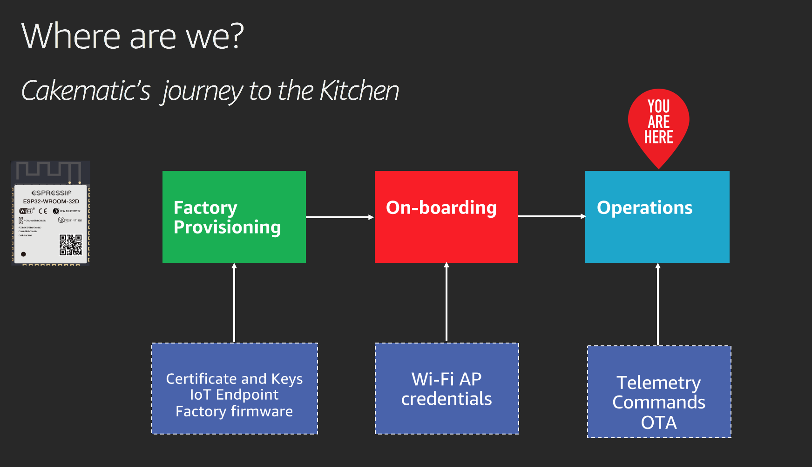

## Introduction

This repository was created to run the re:Invent 2019 Builder session on Amazon FreeRTOS (https://aws.amazon.com/freertos/).

## Pre-requisites

ESP32 Devkit-C boards configured with AWS IoT certificates, endpoints will be provided during the session to participants to practise the sesison. Pre-configured AWS Accounts will be provided to participants for building the demos using a cloud9 environment. All the steps that have been done prior to the workshop will be explained by the instructor and relevant steps/ code will be available in this repository.

## Where are we?

Cakematic (change name and slide) is a modern oven which has state-of-the-art features for baking cakes. Cakematic is currently going through thier pilot and have sent out 1000+ appliances to customers across the US.

The Marketing team has received feedback from Customers that what is said in the User Manual and the actual Appliance LED's do not match up. The Firmware development team has come up with a new image tht need to be deployed to the Wireless module. In this workshop you are going to lear how this is done in the real world using Amazon FreeRTOS and AWS IoT Core.

# Workshop contents

### 1. Workshop setup
The workshop build environment is setup on a Cloud9 environment and will be provided to you by the instructor. ESP-IDF and the xtensa toolchain will be already setup. Login to your Cloud9 environment using the information provided by the instructor. Follow instructions for setting up the required software on the Laptop by clicking [here]() 

### 2. AWS IoT Setup
In this step you will create the Certificates, Keys and code signing certificate required for Over-the-Air updates. Get started by [clicking here for Step 2](docs/02_AWS_IOT_SETUP.md)

### 3. Factory setup and Production firmware build on Cloud9
In this step we are going to create the required assets and production firmware to provision the ESP32 module.Get started by [clicking here for Step 3]()

### 4. Flash firmware and monitor
In this step we are going to are going to flash the firmware and configuration to the ESP32 module .Get started by [clicking here for Step 4]()

### 5. OTA update
Finally, we are going to do an OTA update to fix a bug that was reported to the Marketing team. Get started by [clicking here for Step 5]()

