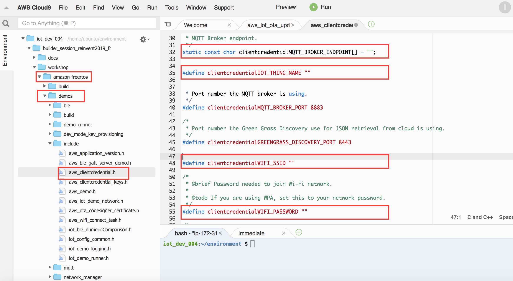

## Factory provisioning
The factory provisioning of the ESP32 module involved provisioning it with AWSI IoT certificates, keys, Code signing certificate and any other configuration that you would like to provide to the Device.

## The partition table 

```
# Name,   Type, SubType, Offset,  Size, Flags
nvs,      data, nvs,     0x10000,  0x6000
otadata,  data, ota,     0x16000,  0x2000
phy_init, data, phy,     0x18000,  0x1000
ota_0,    0,    ota_0,   0x20000,  1500K
ota_1,    0,    ota_1,   ,         1500K
storage,  data, nvs,  ,         0x10000
```

The above partition table represents 2 OTA partitions and (ota_0 and ota_1) and a NVS (non-vlatile storage) ***storage*** partition for storing certificates and configuration. The production firmware is flashed at ota_0. You can use code signing through the AWS IoT Device Management console to sign your code images before deploying them using an over-the-air (OTA) update job.

## Update the Firmware code with the IoT Endpoint,Thing name and Wi-fi credentials

Before building the factory firmware image, we need to update the firmware image with the AWS IoT Endpoint,Thing name of the Thing your script just created and Wi-Fi credentials. Ideally, IoT Endpoint information can go into the storage partition as part of the configuration, however, for the purposes of this workshop let us update the file **aws_clientcredential.h** with the endpoint information. **This approach is not recommended for Production**.

We are going to use the Amazon FreeRTOS ota demo for this workshop. You can find the OTA Demo code in the demos directory of Amazon FreeRTOS git repository,




## Build 


